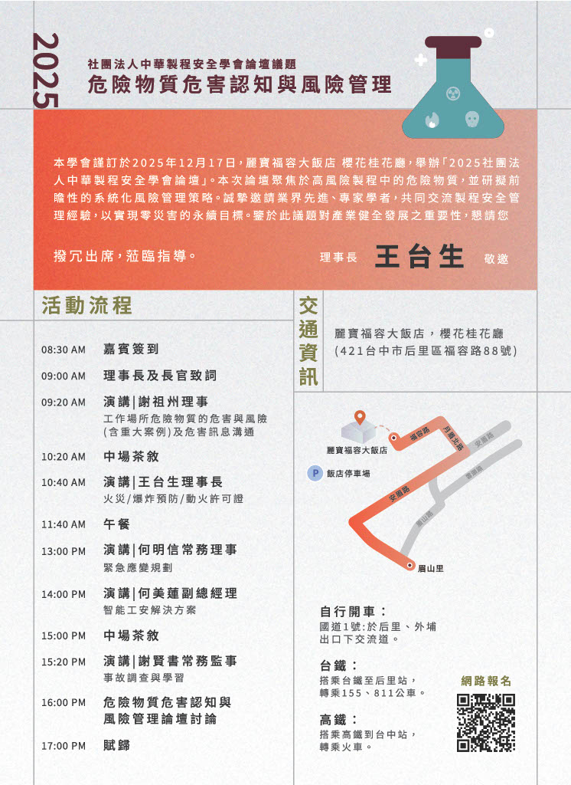

(中華製程安全學會 公告 *`r Sys.Date()`*)

------------------------------------------------------------------------

宣告事項：此網站係本學會為分享業界及職業安全衛生專業人士而規劃，若對於本網站內容有疑惑之處，請諮詢本學會專家群、貴單位職業安全衛生人員，或職安衛領域專家學者，以取得適當或正確資訊，作為管理決策參考。


### 本論壇得以舉辦，特別感謝[台中市勞動檢查處](https://www.doli.taichung.gov.tw/)指導與協助。

##

##### 網站管理單位：

-   **規劃單位：[社團法人中華製程安全學會](http://chpss.org.tw/?.p=Hjpo)** 網站
-   **辦理單位：[創贊科技有限公司](https://peter7336959.github.io/EA/about.html)** 網站（含職業衛生議題）

------------------------------------------------------------------------

## 一、公告 {.tabset .tabset-fade .tabset-pills}

- 20251203：

> **本學會謹訂於2025年12月17日,麗寶福容大飯店 櫻花桂花廳,舉辦
<span style="color: darkred;">\「2025社團法人中華製程安全學會論壇」</span>
。本次論壇聚焦於高風險製程或場域儲存的危險性物質
（具洩漏、中毒、火災、爆炸等危害特性）,並研擬前瞻性的系統化風險管理策略。
誠摯邀請業界先進、專家學者,共同交流製程/生產服務流程之安全管理經驗,以實現
零災害的永績經營目標。鑒於此議題對產業健全發展之重要性,誠摯邀請您參與,
以共同提升職場工安/公安。 ......   理事長 王台生**

------------------------------------------------------------------------

## 二、論壇資訊 {.tabset .tabset-fade .tabset-pills}

------------------------------------------------------------------------

### 活動流程

```{r, echo = FALSE, out.width='100%', fig.align='left', fig.cap=''}

```

------------------------------------------------------------------------

### 提醒事項

-   **課程調整權-** 承辦單位保留活動進行與調整權利。
-   **節能減碳-** 為因應減碳政策，本活動盡量不發放紙本教材，講義等電子檔將提供下載連結。
-   **突發事件因應-** 如遇不可抗力之特殊狀況（如颱風、地震、疫情等），活動將配合政府公告延期或取消，並將相關資訊於本網站公告區公告。
-   **配合事項-** 活動期間請遵守會場規定。

------------------------------------------------------------------------

## 三、論壇資料下載 {#三} 

-   [危險物質之危害與風險 - 謝祖洲理事]

-   [**火災爆炸預防/動火許可 - 王台生理事長**]
-   [緊急應變規劃 - 何明信常務理事](ERM\緊急應變規劃.html)
-   [智能工安解決方案 - 何美蓮副總]
-   [事故調查與學習 - 謝賢書常務監事]
-   [分享-事故調查宣導會講義 pdf](事故調查研討會講義.pdf)
-   [分享-事故調查分析方法圖卡 pdf](事故調查制度實務指南-分析方法圖卡.pdf)
-   [分析方法解析資訊圖表 infographic](tools\info.html)
-   [事故調查制度實務指南]

------------------------------------------------------------------------

## 四、職災事故個案(實例分析) {#三 .tabset .tabset-fade .tabset-pills}

- 以下資訊與連結係參考國內重大職災資料進行分析，供業者事故調查演練及參考用，**內容視演練情境可自行調整，僅供參考用，學員或業者在運用上請自行斟酌**。
- **重要提醒**：提供之各分析參考，是基於所案例的有限資訊，並結合事故調查的專業方法論進行。部分內容為根據邏輯與經驗所做的合理推斷。一場實際、完整的事故調查，需要更詳盡的現場勘查、人員訪談與物證檢驗來支持所有結論。

------------------------------------------------------------------------

### 捲夾案

| 職災類型 | 演練個案 | 分析參考 | 公告訊息 | 完整檔案 |
|:--------------|:--------------|:--------------|:--------------|:--------------|
| 捲夾\*5參考案 |  |  |  |  |
|  | [捲夾案1](cases/A切割夾捲/捲夾案1_演練.pdf) |  [<span style="color: darkgreen;">\*分析參考</span>](cases/A切割夾捲/夾捲案1分析參考.pdf) | 職安署公告 | [原始檔案](cases/A切割夾捲/捲夾案1_原始.pdf) |
|  | [捲夾案2](cases/A切割夾捲/捲夾案2_演練.pdf) | [<span style="color: darkgreen;">\*分析參考</span>](cases/A切割夾捲/夾捲案2分析參考.pdf) | 職安署公告 | [原始檔案](cases/A切割夾捲/捲夾案2_原始.pdf) |
|  | [捲夾案3](cases/A切割夾捲/捲夾案3_演練.pdf) | [<span style="color: darkgreen;">\*分析參考</span>](cases/A切割夾捲/夾捲案3分析參考.pdf)  | 職安署公告 | [原始檔案](cases/A切割夾捲/捲夾案3_原始.pdf) |
|  | [捲夾案4](cases/A切割%20夾捲/捲夾案4_演練.pdf) | [<span style="color: darkgreen;">\*分析參考</span>](cases/A切割夾捲/夾捲案4分析參考.pdf) | 參考用 | [原始檔案](cases/A切割夾捲/捲夾案4_原始.pdf) |
|  | [捲夾案5](cases/A切割夾捲/捲夾案5_演練.pdf) | [<span style="color: darkgreen;">\*分析參考</span>](cases/A切割夾捲/夾捲案5分析參考.pdf)  | 職安署公告 | [原始檔案](cases/A切割夾捲/捲夾案5_原始.pdf) |

------------------------------------------------------------------------

### 倒塌崩塌個案

| 職災類型 | 演練個案 | 分析參考 | 公告訊息 | 完整檔案 |
|:--------------|:--------------|:--------------|:--------------|:--------------|
| 倒塌崩塌\*4參考案 |  |  |  |  |
|  | [倒塌崩塌案1](cases/D倒塌崩塌/倒塌案1_演練.pdf) | [<span style="color: darkgreen;">\*分析參考</span>](cases/D倒塌崩塌/倒塌案1_分析參考.pdf)  | 職安署公告 | [原始檔案](cases/D倒塌崩塌/倒塌案1_原始.pdf) |
|  | [倒塌崩塌案2](cases/D倒塌崩塌/倒塌案2_演練.pdf) | [<span style="color: darkgreen;">\*分析參考</span>](cases/D倒塌崩塌/倒塌案2_分析參考.pdf)  | 職安署公告 | [原始檔案](cases/D倒塌崩塌/倒塌案2_原始.pdf) |
|  | [倒塌崩塌案3](cases/D倒塌崩塌/倒塌案3_演練.pdf) | [<span style="color: darkgreen;">\*分析參考</span>](cases/D倒塌崩塌/倒塌案3_分析參考.pdf)  | 職安署公告 | [原始檔案](cases/D倒塌崩塌/倒塌案3_原始.pdf) |
|  | [倒塌崩塌案4](cases/D倒塌崩塌/倒塌案4_演練.pdf) | [<span style="color: darkgreen;">\*分析參考</span>](cases/D倒塌崩塌/倒塌案4_分析參考.pdf) | 職安署公告 | [原始檔案](cases/D倒塌崩塌/倒塌案4_原始.pdf) |

------------------------------------------------------------------------

### 感電案

| 職災類型 | 演練個案 | 分析參考 | 公告訊息 | 完整檔案 |
|:--------------|:--------------|:--------------|:--------------|:--------------|
| 感電\*4參考案 |  |  |  |  |
|  | [感電案1](cases/E感電/感電案1_演練.pdf) | [<span style="color: darkgreen;">\*分析參考</span>](cases/E感電/感電案1_分析參考.pdf)  | 職安署公告 | [原始檔案](cases/E感電/感電案1_原始.pdf) |
|  | [感電案2](cases/E感電/感電案2_演練.pdf) | [<span style="color: darkgreen;">\*分析參考</span>](cases/E感電/感電案2_分析參考.pdf) | 職安署公告 | [原始檔案](cases/E感電/感電案2_原始.pdf) |
|  | [感電案3](cases/E感電/感電案3_演練.pdf) | [<span style="color: darkgreen;">\*分析參考</span>](cases/E感電/感電案3_分析參考.pdf) | 參考用 | [原始檔案](cases/E感電/感電案3_原始.pdf) |
|  | [感電案4](cases/E感電/感電案4_演練.pdf) | [<span style="color: darkgreen;">\*分析參考</span>](cases/E感電/感電案4_分析參考.pdf)  | 職安署公告 | [原始檔案](cases/E感電/感電案4_原始.pdf) |

------------------------------------------------------------------------

### 火災爆炸案

| 職災類型 | 演練個案 | 分析參考 | 公告訊息 | 完整檔案 |
|:--------------|:--------------|:--------------|:--------------|:--------------|
| 火災爆炸\*5參考案 |  |  |  |  |
|  | [火災爆炸案1](cases/B火災爆炸/火災爆炸案1_演練.pdf) | [<span style="color: darkgreen;">\*分析參考</span>](cases/B火災爆炸/火災爆炸案1_分析參考.pdf)   | 職安署公告 | [原始檔案](cases/B火災爆炸/火災爆炸案1_原始.pdf) |
|  | [火災爆炸案2](cases/B火災爆炸/火災爆炸案2_演練.pdf) | [<span style="color: darkgreen;">\*分析參考</span>](cases/B火災爆炸/火災爆炸案2_分析參考.pdf)   | 職安署公告 | [原始檔案](cases/B火災爆炸/火災爆炸案2_原始.pdf) |
|  | [火災爆炸案3](cases/B火災爆炸/火災爆炸案3_演練.pdf) | [<span style="color: darkgreen;">\*分析參考</span>](cases/B火災爆炸/火災爆炸案3_分析參考.pdf)   | 職安署公告 | [原始檔案](cases/B火災爆炸/火災爆炸案3_原始.pdf) |
|  | [火災爆炸案4](cases/B火災爆炸/火災爆炸案4_演練.pdf) | [<span style="color: darkgreen;">\*分析參考</span>](cases/B火災爆炸/火災爆炸案4_分析參考.pdf) | 職安署公告 | [原始檔案](cases/B火災爆炸/火災爆炸案4_原始.pdf) |
|  | [火災爆炸案5](cases/B火災爆炸/火災爆炸案5_演練.pdf) | [<span style="color: darkgreen;">\*分析參考</span>](cases/B火災爆炸/火災爆炸案5_分析參考.pdf) | 職安署公告 | [原始檔案](cases/B火災爆炸/火災爆炸案5_原始.pdf) |

------------------------------------------------------------------------

### 局限空間案

| 職災類型 | 演練個案 | 分析參考 | 公告訊息 | 完整檔案 |
|:--------------|:--------------|:--------------|:--------------|:--------------|
| 局限空間\*5參考案 |  |  |  |  |
|  | [局限空間案1](cases/C局限空間/局限案例1_演練.pdf) | [<span style="color: darkgreen;">\*分析參考</span>](cases/C局限空間/局限案例1_分析參考.pdf) | 參考用 | [原始檔案](cases/C局限空間/局限案例1_原始.pdf) |
|  | [局限空間案2](cases/C局限空間/局限案例2_演練.pdf) | [<span style="color: darkgreen;">\*分析參考</span>](cases/C局限空間/局限案例2_分析參考.pdf)  | 職安署電子書 | [原始檔案](cases/C局限空間/局限案例2_原始.pdf) |
|  | [局限空間案3](cases/C局限空間/局限案例3_演練.pdf) | [<span style="color: darkgreen;">\*分析參考</span>](cases/C局限空間/局限案例3_分析參考.pdf)  | 職安署電子書 | [原始檔案](cases/C局限空間/局限案例3_原始.pdf) |
|  | [局限空間案4](cases/C局限空間/局限案例4_演練.pdf) | [<span style="color: darkgreen;">\*分析參考</span>](cases/C局限空間/局限案例4_分析參考.pdf) | 職安署電子書 | [原始檔案](cases/C局限空間/局限案例4_原始.pdf) |
|  | [局限空間案5](cases/C局限空間/局限案例5_演練.pdf) | [<span style="color: darkgreen;">\*分析參考</span>](cases/C局限空間/局限案例5_分析參考.pdf) | 參考用 | [原始檔案](cases/C局限空間/局限案例5_原始.pdf) |

------------------------------------------------------------------------

### 墜落案

| 職災類型 | 演練個案 | 分析參考 | 公告訊息 | 完整檔案 |
|:--------------|:--------------|:--------------|:--------------|:--------------|
| 墜落\*3參考案 |  |  |  |  |
|  | [墜落案1](cases/F墜落/墜落案1_演練.pdf) | [<span style="color: darkgreen;">\*分析參考</span>](cases/F墜落/墜落案1_分析參考.pdf)  | 職安署公告 | [原始檔案](cases/F墜落/墜落案1_原始.pdf) |
|  | [墜落案2](cases/F墜落/墜落案2_演練.pdf) | [<span style="color: darkgreen;">\*分析參考</span>](cases/F墜落/墜落案2_分析參考.pdf)  | 職安署公告 | [原始檔案](cases/F墜落/墜落案2_原始.pdf) |
|  | [墜落案3](cases/F墜落/墜落案3_演練.pdf) | [<span style="color: darkgreen;">\*分析參考</span>](cases/F墜落/墜落案3_分析參考.pdf) | 參考用 | [原始檔案](cases/F墜落/墜落案3_原始.pdf) |

------------------------------------------------------------------------

### 熱疾病案

| 職災類型 | 演練個案 | 分析參考 | 公告訊息 | 完整檔案 |
|:--------------|:--------------|:--------------|:--------------|:--------------|
| 熱疾病\*2參考案 |  |  |  |  |
|  | [熱疾病案1](cases/H熱疾病/熱疾病案1_演練.pdf) | [<span style="color: darkgreen;">\*分析參考</span>](cases/H熱疾病/熱疾病案1_分析參考.pdf) |  | [原始檔案](cases/H熱疾病/熱疾病案1_原始.pdf) |
|  | [熱疾病案2](cases/H熱疾病/熱疾病案2_演練.pdf) |[<span style="color: darkgreen;">\*分析參考</span>](cases/H熱疾病/熱疾病案2_分析參考.pdf)   | 職安署公告 | [原始檔案](cases/H熱疾病/熱疾病案2_原始.pdf) |

------------------------------------------------------------------------

## 五、事故調查實務指南簡介 {.tabset .tabset-fade .tabset-pills}

- 依據職災預防中心「114年製造業職業災害事故調查推廣計畫」，製作**「事故調查制度實務指南」**。

> 指南主要參考國內外相關指引，並結合實際案例製作。這裡呈現的是指南一部分摘錄，內容以經正式審查編印後為準。 本指南為提升我國職業災害事故調查品質，提供**雇主、職安衛專業人員、勞工代表等**，一套系統化且實用的事故調查參考架構與指引，特別強調事故調查分析方法實務使用，以協助職安衛專業人員提升事故調查專業技能，使業者在事故經驗學習時，能有效預防事故發生或再次發生。

### **目錄** 

> 出席論壇者，有機會可以取得職災預防中心編印之**「事故調查制度實務指南」**一本。

- 一. 前言
- 二. 事故調查角色定位
- 三. 事故調查相關用語與定義
- 四. 良好事故調查構成要素
- 五. 事故因果模型
- 六. 事故調查流程與查檢表
- 七. 事故調查專業技能
- 八. 事故調查分析方法
- 九. 矯正措施建議
- 十. 事故報告書參考建議
- 十一. 結論

------------------------------------------------------------------------

### 附錄 **(事故調查分析方法圖卡等)**

> [事故調查分析方法圖卡：電子檔下載] (詳見[第六節](#六))

-   附錄 A 「事故成因分析/圖 (ECFA/ECFC)」使用參考圖卡
-   附錄 B 「時間序列表」使用參考圖卡
-   附錄 C 「為何樹(WHY Tree)分析」使用參考圖卡
-   附錄 D 「屏障分析(Barrier Analysis)」使用參考圖卡
-   附錄 E 「變更分析(Change Analysis)」使用參考圖卡
-   附錄 F 「訪談提示事項 (參考用)」
-   附錄 G 「良好事故調查要項查檢表(HSE)」

------------------------------------------------------------------------

### 國內外指引與資料**(建議研讀)**

> **主要參考國內外指引與資料** 

| No | 機構 | 指引名稱 | 年份 |
|:---|:-------------|:---------------------------------------|:-------------|
| 1 | [勞研所 IOSH](https://criteria.ilosh.gov.tw/iLosh/wSite/ct?xItem=34753&ctNode=322&mp=3) | 事故調查方法應用研究 | 2000 |
| 2 | 美國化學工程師學會AIChE | Guidelines for Investigating Chemical Process Incidents 2nd | 2003 |
| 3 | [英國 HSE](https://www.hse.gov.uk/pubns/books/hsg245.htm) | Investigating accidents and incidents: A workbook for employers, unions, safety representatives and safety professionals(HSG245) | 2004 |
| 4 | 美國能源部 DOE | Accident and Operational Safety Analysis, Volume I, Accident Analysis Techniques | 2012 |
| 5 | [美國US OSHA](https://www.osha.gov/incident-investigation) | Incident [Accident] Investigations: A Guide for Employers | 2015 |
| 6 | [聯合國組織ILO](https://www.ilo.org/publications/investigation-occupational-accidents-and-diseases) | A practical guide for labour inspectors: Investigation of occupational accidents and diseases | 2015 |
| 7 | 澳洲 AIHS | Investigations (Core Body of Knowledge for the Generalist OHS Professional) | 2024 |
|  |  |  |  |

## 六、常見認知謬誤 {#六}

-   事故調查[常見認知謬誤](info\info.html)
    1.  歸因偏誤 
    2.  確認偏誤 
    3.  因果偏誤 
    4.  後見之明偏誤 


