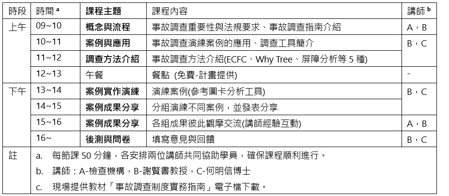

(中華製程安全學會 公告 *`r Sys.Date()`*)

------------------------------------------------------------------------

### 計畫於北中南區辦理4場次宣導會(工作坊)。

##### 辦理單位：

-   **計畫單位：財團法人職業災害預防及重建中心**
-   **承辦單位：社團法人中華製程安全學會**

------------------------------------------------------------------------

## 一、公告 {.tabset .tabset-fade .tabset-pills}

- 1105：於職災預防中心辦理事故調查方法工具內部教育訓練研討。
- 本計畫宣導研討會[**已辦理完成**]{style="color: red;"}[[如活動照片](image.html)]，希望再有機會協助職安衛專業人員，提升事故調查本質學能。
- 0923：北區2分享演練案例，第8，10組初步成果分享(詳見[第三節](#三))。
- 0918：北區第2場研討會(0918週四)已順利辦理完成，感謝大家參與，及北區職安衛中心協助。
- 0918：敬請北區第2場各組將演練完成檔案，於0924(週三)前寄出(尊重您的分享意願)，檔案名稱為”北區2第\_\_組”。
-   0913：北區第1場分享演練案例，感謝第2，8，10組初步成果分享(詳見[第三節](#三))
-   0904：中區第5組分享演練案例-感電案3
-   0904：北區第1場之職安回訓6小時證明，北區職安衛中心，作業需要約一週時間。
-   0902：敬請北區第一場各組將演練完成檔案，於0909(週二)前寄出(尊重您的分享意願)，檔案名稱為”北區1第\_\_組”。
-   0825：中區分享演練案例，感謝第 4，6，7 組初步成果分享(詳見[第三節](#三))
-   0822：中區研討會(0821週四)已順利辦理完成，感謝大家參與，及中市勞檢處大力協助。
-   0815：南區分享演練案例，感謝第2，3，4，5，6，9，10組初步成果分享(詳見[第三節](#三))。
-   0815：新增 後見之明、因果、歸因、確認偏誤 - 事故調查時常見心理認知謬誤。
-   0805：宣導會講義 pdf。
-   0803：分析方法解析資訊圖表-infographic(詳見[第六節](#六))
-   0731：演練個案可使用自己公司案例 (案例可調整)。
-   0730：工作坊即將開始，仍有學員未填前測問卷，請課前填寫前測問卷表單
-   0729：提供案例演練分析參考表格，可先參考分析方法圖卡自行分析，以利小組討論。
-   0727：若遇有颱風將至或重大事故等，延期或變更事宜將於此處公告。
-   0727：宣導會報名成功名單 (點選各區查看確認)

------------------------------------------------------------------------

### 北區2 **完成公告**
- 0923：北區2分享演練案例，感謝第[**8，10組**]{style="color: red;"}初步成果分享(詳見[第三節](#三))。
- 0918 北區第2場研討會(0918週四)已順利辦理完成，感謝大家參與，及北區職安衛中心協助。
- (**報名43人**，甄選43人) **地點：職安署北區職業安全衛生中心(新北市新莊區中平路439號 - 北棟10樓1015會議室)**

```{r echo = FALSE, warning=FALSE, error=FALSE, message=FALSE}
#library(readxl)
#宣導會名單 <- read_excel("報名資訊/宣導會名單_錄取.xlsx",
#col_types = c("skip", "skip", "skip",
#"skip", "skip", "text", "text", "text",
#"text", "text", "text", "skip"))

#library(tidyverse)
#宣導會名單 <- 宣導會名單 %>% rename(姓名匿稱=name, 公司匿稱=cop)
#library(kableExtra)
#  kable(宣導會名單) 
#宣導會名單 %>% filter(確認場次=="北區9月18日" & 亂數抽籤=="y") %>% 
#  select(-2) %>% arrange(分組)%>%
#  kbl() %>%
#  kable_classic(bootstrap_options = c("striped", "hover"), 
#    position =  "left", fixed_thead = T,full_width = F) %>%
#    row_spec(0, bold = T)%>%
#    column_spec(1, bold = T )%>%
#    column_spec(2, bold = T, background = "lightyellow")%>%
#    pack_rows("第1組", 1, 3,label_row_css = "background-color: #666; color: #fff;") %>%
#    pack_rows("第2組", 4, 7,label_row_css = "background-color: #666; color: #fff;") %>%
#    pack_rows("第3組", 8, 11,label_row_css = "background-color: #666; color: #fff;") %>%
#    pack_rows("第4組", 12, 15,label_row_css = "background-color: #666; color: #fff;") %>%
#    pack_rows("第5組", 16, 20,label_row_css = "background-color: #666; color: #fff;") %>%
#    pack_rows("第6組", 21, 24,label_row_css = "background-color: #666; color: #fff;") %>%
#    pack_rows("第7組", 25, 29,label_row_css = "background-color: #666; color: #fff;") %>%
#    pack_rows("第8組", 30, 33,label_row_css = "background-color: #666; color: #fff;") %>%
#    pack_rows("第9組", 34, 37,label_row_css = "background-color: #666; color: #fff;") %>%
#    pack_rows("第10組", 38, 41,label_row_css = "background-color: #666; color: #fff;") %>%
# footnote(general = "暫時分組，上課時可再調整。指定演練案例-可先參見下面案例清單")%>%
#    scroll_box(width = "600px", height = "200px")
```

------------------------------------------------------------------------

### 北區1 完成公告

-   0913：感謝[**第2，8，10組**]{style="color: red;"}初步成果分享(詳見[第三節](#三))
-   0902 北區第一場研討會(0902週一)已順利辦理完成，感謝大家參與，及北區職安衛中心協助。
-   (報名87人，甄選41人) 地點：職安署北區職業安全衛生中心(新北市新莊區中平路439號 - 北棟10樓1015會議室)

```{r echo = FALSE, warning=FALSE,,error=FALSE, message=FALSE}
#library(readxl)
#宣導會名單 <- read_excel("報名資訊/宣導會名單_錄取.xlsx",
#col_types = c("skip", "skip", "skip",
#"skip", "skip", "text", "text", "text",
#"text", "text", "text", "skip"))

#library(tidyverse)
#宣導會名單 <- 宣導會名單 %>% rename(姓名匿稱=name, 公司匿稱=cop)
#library(kableExtra)
#宣導會名單 %>% filter(確認場次=="北區9月02日"& 亂數抽籤=="y") %>% select(-2) %>%
#  kbl() %>%
#  kable_classic(bootstrap_options = c("striped", "hover"), 
#    position =  "left", fixed_thead = T,full_width = F) %>%
#    row_spec(0, bold = T)%>%
#    column_spec(1, bold = T )%>%
#    column_spec(2, bold = T, background = "lightyellow")%>%
#    pack_rows("第1組", 1, 4,label_row_css = "background-color: #666; color: #fff;") %>%
#    pack_rows("第2組", 5, 8,label_row_css = "background-color: #666; color: #fff;") %>%
#    pack_rows("第3組", 9, 12,label_row_css = "background-color: #666; color: #fff;") %>%
#    pack_rows("第4組", 13, 16,label_row_css = "background-color: #666; color: #fff;") %>%
#    pack_rows("第5組", 17, 20,label_row_css = "background-color: #666; color: #fff;") %>%
#    pack_rows("第6組", 21, 24,label_row_css = "background-color: #666; color: #fff;") %>%
#    pack_rows("第7組", 25, 28,label_row_css = "background-color: #666; color: #fff;") %>%
#    pack_rows("第8組", 29, 32,label_row_css = "background-color: #666; color: #fff;") %>%
#    pack_rows("第9組", 33, 36,label_row_css = "background-color: #666; color: #fff;") %>%
#    pack_rows("第10組",37, 41,label_row_css = "background-color: #666; color: #fff;") %>%
#footnote(general = "按報名順序暫時分組，指定演練案例-可先參見下面案例清單")%>%
#    scroll_box(width = "600px", height = "200px")

```

------------------------------------------------------------------------

### 中區 完成公告

-   0825 **感謝中區[第 4，6，7 組]{style="color: red;"}分享演練成果(詳見[第三節](#三))**
-   0822 敬請**中區**各組將演練完成檔案，於0828(週四)寄出(尊重您的分享意願)，檔案名稱為”中區第_組”。
-   0822 **中區(0821週四)已順利辦理完成，感謝大家參與。**
-   0822 敬請各組將演練完成檔案，於0828(週四)寄出(尊重您的分享意願)，檔案名稱為”中區第_組”。
-   0822 **中區(0821週四)已順利辦理完成，感謝大家參與。**
-   (**報名92人**，甄選44人) 於0821(週五)中市勞檢處

```{r echo = FALSE, warning=FALSE,  error=FALSE, message=FALSE}
library(readxl)
#宣導會名單 <- read_excel("報名資訊/宣導會名單_錄取.xlsx",
#col_types = c("skip", "skip", "skip",
#"skip", "skip", "text", "text", "text",
#"text", "text", "text", "skip"))

#library(tidyverse)
#宣導會名單 <- 宣導會名單 %>% rename(姓名匿稱=name, 公司匿稱=cop)
#library(kableExtra)
#  kable(宣導會名單) 
#宣導會名單 %>% filter(確認場次=="中區8月21日" & 亂數抽籤=="y") %>% select(-2) %>%
#  kbl() %>%
#  kable_classic(bootstrap_options = c("striped", "hover"), 
#    position =  "left", fixed_thead = T,full_width = F) %>%
#    row_spec(0, bold = T)%>%
#    column_spec(1, bold = T )%>%
#    column_spec(2, bold = T, background = "lightyellow")%>%
#    pack_rows("第1組", 1, 4,label_row_css = "background-color: #666; color: #fff;") %>%
#    pack_rows("第2組", 5, 8,label_row_css = "background-color: #666; color: #fff;") %>%
#    pack_rows("第3組", 9, 12,label_row_css = "background-color: #666; color: #fff;") %>%
#    pack_rows("第4組", 13, 16,label_row_css = "background-color: #666; color: #fff;") %>%
#    pack_rows("第5組", 17, 20,label_row_css = "background-color: #666; color: #fff;") %>%
#    pack_rows("第6組", 21, 25,label_row_css = "background-color: #666; color: #fff;") %>%
#    pack_rows("第7組", 26, 30,label_row_css = "background-color: #666; color: #fff;") %>%
#    pack_rows("第8組", 31, 34,label_row_css = "background-color: #666; color: #fff;") %>%
#    pack_rows("第9組", 35, 39,label_row_css = "background-color: #666; color: #fff;") %>%
#    pack_rows("第10組",40, 44,label_row_css = "background-color: #666; color: #fff;") %>%
#footnote(general = "按報名順序暫時分組，指定演練案例-可先參見下面案例清單")%>%
#    scroll_box(width = "600px", height = "200px")

```

------------------------------------------------------------------------

### 南區完成公告

-   0815 **感謝南區[第 2，3，4，5，6，9及10 組]{style="color: red;"}完整分享演練成果(詳見[第三節](#三))**
-   0805 **敬請各組將演練完成檔案，於0811(週一)寄出(尊重您的分享意願)，檔案名稱為"南區第 \_ 組"。**
-   0805 **已於 三、演練職災事故個案(實例)區，分享學員初步成果。**
-   0805 **南區(0805週二)已順利辦理完成，感謝大家參與。**
-   (**報名48人**，甄選47人) **於0805(週二)高市勞檢處**

```{r echo = FALSE, warning=FALSE, ,error=FALSE, message=FALSE}
library(tidyverse)
library(readxl)
#宣導會名單 <- read_excel("報名資訊/宣導會名單_錄取.xlsx",
#col_types = c("skip", "skip", "skip",
#"skip", "skip", "text", "text", "text",
#"text", "text", "text", "skip"))

#宣導會名單 <- 宣導會名單 %>% rename(姓名匿稱=name, 公司匿稱=cop)
#library(kableExtra)
#宣導會名單 %>% filter(確認場次=="南區8月05日" & 亂數抽籤=="y") %>% #select(-2) %>%
#  kbl() %>%
#  kable_classic(bootstrap_options = c("striped", "hover"), 
#    position =  "left", fixed_thead = T,full_width = F) %>%
#    row_spec(0, bold = T)%>%
#    column_spec(1, bold = T )%>%
#    column_spec(2, bold = T, background = "lightyellow")%>%
#    pack_rows("第1組", 1, 4,label_row_css = "background-color: #666; color: ##fff;") %>%
#    pack_rows("第2組", 5, 8,label_row_css = "background-color: #666; color: ##fff;") %>%
#    pack_rows("第3組", 9, 13,label_row_css = "background-color: #666; color: ##fff;") %>%
#    pack_rows("第4組", 14, 18,label_row_css = "background-color: #666; #color: #fff;") %>%
#    pack_rows("第5組", 19, 23,label_row_css = "background-color: #666; #color: #fff;") %>%
#    pack_rows("第6組", 24, 28,label_row_css = "background-color: #666; #color: #fff;") %>%
#    pack_rows("第7組", 29, 33,label_row_css = "background-color: #666; #color: #fff;") %>%
#    pack_rows("第8組", 34, 38,label_row_css = "background-color: #666; #color: #fff;") %>%
#    pack_rows("第9組", 39, 43,label_row_css = "background-color: #666; #color: #fff;") %>%
#    pack_rows("第10組",44, 47,label_row_css = "background-color: #666; #color: #fff;") %>%
#footnote(general = "按報名順序暫時分組，指定演練案例-可先參見下面案例清單")%#>%
#    scroll_box(width = "500px", height = "200px")

```

------------------------------------------------------------------------

### **活動照片集**

#### 活動照片 ([北/中/南區研討會](image.html))

------------------------------------------------------------------------

## 二、宣導會(工作坊)資訊 {.tabset .tabset-fade .tabset-pills}

### 案例演練表格

-   [案例演練分析參考表格-可自行編修](演練案分析格式.docx)

------------------------------------------------------------------------

### 事故調查分析方法圖卡

-   [事故調查分析方法圖卡：電子檔下載]  (詳見[第六節](#六))

------------------------------------------------------------------------

### 課程表

```{r, echo = FALSE, out.width='100%', fig.align='left', fig.cap=''}

```

------------------------------------------------------------------------

### 報名簡章

-   [報名簡章-已額滿](114年度%20我國製造業職災事故調查推廣計畫宣導會%20報名簡章.pdf)

------------------------------------------------------------------------

### 提醒事項

-   **課程調整權-** 承辦單位保留課程進行與調整權利。
-   **節能減碳-** 為因應減碳政策，本活動盡量不發放紙本教材與教具，電子檔將提供下載連結。
-   **在職教育訓練時數證明-** 全程參與本活動者，合辦單位於活動結束後，依規定核發在職教育訓練時數6小時證明。參加者需於報到時簽到退，遲到或早退15分鐘以上者，不予發放時數條。
-   **突發事件因應-** 如遇不可抗力之特殊狀況（如颱風、地震、疫情等），活動將配合政府公告延期或取消，執行單位事後將以電子郵件通知報名人員改期辦理。
-   **建議學員自備筆電-** 方便進行案例演練與發表分享，或以A4紙本演練。
-   **配合事項-** 活動期間請遵守會場規定，若有飲食灑落造成設備損壞，學員須自負賠償責任。

------------------------------------------------------------------------

## 三、演練職災事故個案(實例) {#三 .tabset .tabset-fade .tabset-pills}

- [學員分組演練產出]{style="color: red;"} ，**擇優與遵從各組意願放置此網頁**，分析參考欄位中。

- 以下資訊與連結係參考國內重大職災資料進行分析，供事故調查指南課程演練及參考用，**內容視演練情境可自行調整，僅供參考用，學員或業者在運用上請自行斟酌**。
- **演練個案可使用自己公司案例 (案例可調整)。**
- **重要提醒**：提供之各分析參考，是基於所案例的有限資訊，並結合事故調查的專業方法論進行。部分內容為根據邏輯與經驗所做的合理推斷。一場實際、完整的事故調查，需要更詳盡的現場勘查、人員訪談與物證檢驗來支持所有結論。

------------------------------------------------------------------------

### 捲夾案

| 職災類型 | 演練個案 | 分析參考 | 公告訊息 | 完整檔案 |
|:--------------|:--------------|:--------------|:--------------|:--------------|
| 捲夾\*5參考案 |  |  |  |  |
|  | [捲夾案1](cases/A切割夾捲/捲夾案1_演練.pdf) |  [<span style="color: darkgreen;">\*分析參考</span>](cases/A切割夾捲/夾捲案1分析參考.pdf) | 職安署公告 | [原始檔案](cases/A切割夾捲/捲夾案1_原始.pdf) |
|  | [捲夾案2](cases/A切割夾捲/捲夾案2_演練.pdf) | [<span style="color: darkgreen;">\*分析參考</span>](cases/A切割夾捲/夾捲案2分析參考.pdf) | 職安署公告 | [原始檔案](cases/A切割夾捲/捲夾案2_原始.pdf) |
|  | [捲夾案3](cases/A切割夾捲/捲夾案3_演練.pdf) | [<span style="color: darkgreen;">\*分析參考</span>](cases/A切割夾捲/夾捲案3分析參考.pdf)  | 職安署公告 | [原始檔案](cases/A切割夾捲/捲夾案3_原始.pdf) |
|  | [捲夾案4](cases/A切割%20夾捲/捲夾案4_演練.pdf) | [<span style="color: darkgreen;">\*分析參考</span>](cases/A切割夾捲/夾捲案4分析參考.pdf) | 參考用 | [原始檔案](cases/A切割夾捲/捲夾案4_原始.pdf) |
|  |  | [[中區第6組分享](cases/A切割夾捲/中區第6組演練分享.pdf)]{style="color: red;"} | @中區第6組 |  |
|  |  | [[南區第6組分享](cases/A切割夾捲/南區第6組演練分享.pdf)]{style="color: red;"} | @南區第6組 |  |
|  | [捲夾案5](cases/A切割夾捲/捲夾案5_演練.pdf) | [<span style="color: darkgreen;">\*分析參考</span>](cases/A切割夾捲/夾捲案5分析參考.pdf)  | 職安署公告 | [原始檔案](cases/A切割夾捲/捲夾案5_原始.pdf) |

------------------------------------------------------------------------

### 倒塌崩塌個案

| 職災類型 | 演練個案 | 分析參考 | 公告訊息 | 完整檔案 |
|:--------------|:--------------|:--------------|:--------------|:--------------|
| 倒塌崩塌\*4參考案 |  |  |  |  |
|  | [倒塌崩塌案1](cases/D倒塌崩塌/倒塌案1_演練.pdf) | [<span style="color: darkgreen;">\*分析參考</span>](cases/D倒塌崩塌/倒塌案1_分析參考.pdf)  | 職安署公告 | [原始檔案](cases/D倒塌崩塌/倒塌案1_原始.pdf) |
|  | [倒塌崩塌案2](cases/D倒塌崩塌/倒塌案2_演練.pdf) | [<span style="color: darkgreen;">\*分析參考</span>](cases/D倒塌崩塌/倒塌案2_分析參考.pdf)  | 職安署公告 | [原始檔案](cases/D倒塌崩塌/倒塌案2_原始.pdf) |
|  | [倒塌崩塌案3](cases/D倒塌崩塌/倒塌案3_演練.pdf) | [<span style="color: darkgreen;">\*分析參考</span>](cases/D倒塌崩塌/倒塌案3_分析參考.pdf)  | 職安署公告 | [原始檔案](cases/D倒塌崩塌/倒塌案3_原始.pdf) |
|  | [倒塌崩塌案4](cases/D倒塌崩塌/倒塌案4_演練.pdf) | [<span style="color: darkgreen;">\*分析參考</span>](cases/D倒塌崩塌/倒塌案4_分析參考.pdf) | 職安署公告 | [原始檔案](cases/D倒塌崩塌/倒塌案4_原始.pdf) |
|  |  | [[中區第4組分享](cases/D倒塌崩塌/中區第4組演練分享.pdf)]{style="color: red;"} | @中區第4組 |  |
|  |  | [[南區第4組分享](cases/D倒塌崩塌/南區第4組演練分享.pdf)]{style="color: red;"} | @南區第4組 |  |
|  |  | [[南區第9組分享](cases/D倒塌崩塌/南區第9組演練分享.pdf)]{style="color: red;"} | @南區第9組 |  |

------------------------------------------------------------------------

### 感電案

| 職災類型 | 演練個案 | 分析參考 | 公告訊息 | 完整檔案 |
|:--------------|:--------------|:--------------|:--------------|:--------------|
| 感電\*4參考案 |  |  |  |  |
|  | [感電案1](cases/E感電/感電案1_演練.pdf) | [<span style="color: darkgreen;">\*分析參考</span>](cases/E感電/感電案1_分析參考.pdf)  | 職安署公告 | [原始檔案](cases/E感電/感電案1_原始.pdf) |
|  |  | [[南區第10組分享](cases/E感電/南區第10組演練分享.pdf)]{style="color: red;"} | @南區第10組 |  |
|  | [感電案2](cases/E感電/感電案2_演練.pdf) | [<span style="color: darkgreen;">\*分析參考</span>](cases/E感電/感電案2_分析參考.pdf) | 職安署公告 | [原始檔案](cases/E感電/感電案2_原始.pdf) |
|  |  | [[北區1第8組分享](cases/E感電/北區1第8組演練分享.pdf)]{style="color: red;"} | @北區1第8組 |  |
|  | [感電案3](cases/E感電/感電案3_演練.pdf) | [<span style="color: darkgreen;">\*分析參考</span>](cases/E感電/感電案3_分析參考.pdf) | 參考用 | [原始檔案](cases/E感電/感電案3_原始.pdf) |
|  |  | [[中區第5組分享](cases/E感電/中區第5組演練分享.pdf)]{style="color: red;"} | @中區第5組 |  |
|  |  | [[南區第5組分享](cases/E感電/南區第5組演練分享.pdf)]{style="color: red;"} | @南區第5組 |  |
|  |  |  |  |  |
|  | [感電案4](cases/E感電/感電案4_演練.pdf) | [<span style="color: darkgreen;">\*分析參考</span>](cases/E感電/感電案4_分析參考.pdf)  | 職安署公告 | [原始檔案](cases/E感電/感電案4_原始.pdf) |

------------------------------------------------------------------------

### 火災爆炸案

| 職災類型 | 演練個案 | 分析參考 | 公告訊息 | 完整檔案 |
|:--------------|:--------------|:--------------|:--------------|:--------------|
| 火災爆炸\*5參考案 |  |  |  |  |
|  | [火災爆炸案1](cases/B火災爆炸/火災爆炸案1_演練.pdf) | [<span style="color: darkgreen;">\*分析參考</span>](cases/B火災爆炸/火災爆炸案1_分析參考.pdf)   | 職安署公告 | [原始檔案](cases/B火災爆炸/火災爆炸案1_原始.pdf) |
|  | [火災爆炸案2](cases/B火災爆炸/火災爆炸案2_演練.pdf) | [<span style="color: darkgreen;">\*分析參考</span>](cases/B火災爆炸/火災爆炸案2_分析參考.pdf)   | 職安署公告 | [原始檔案](cases/B火災爆炸/火災爆炸案2_原始.pdf) |
|  | [火災爆炸案3](cases/B火災爆炸/火災爆炸案3_演練.pdf) | [<span style="color: darkgreen;">\*分析參考</span>](cases/B火災爆炸/火災爆炸案3_分析參考.pdf)   | 職安署公告 | [原始檔案](cases/B火災爆炸/火災爆炸案3_原始.pdf) |
|  | [火災爆炸案4](cases/B火災爆炸/火災爆炸案4_演練.pdf) | [<span style="color: darkgreen;">\*分析參考</span>](cases/B火災爆炸/火災爆炸案4_分析參考.pdf) | 職安署公告 | [原始檔案](cases/B火災爆炸/火災爆炸案4_原始.pdf) |
|  | [火災爆炸案5](cases/B火災爆炸/火災爆炸案5_演練.pdf) | [<span style="color: darkgreen;">\*分析參考</span>](cases/B火災爆炸/火災爆炸案5_分析參考.pdf) | 職安署公告 | [原始檔案](cases/B火災爆炸/火災爆炸案5_原始.pdf) |
|  |  | [[北區2第10組分享](cases/B火災爆炸/北區2第10組演練分享.pdf)]{style="color: red;"} | @北區2第10組 |  |
|  |  | [[北區1第10組分享](cases/B火災爆炸/北區1第10組演練分享.pdf)]{style="color: red;"} | @北區1第10組 |  |

------------------------------------------------------------------------

### 局限空間案

| 職災類型 | 演練個案 | 分析參考 | 公告訊息 | 完整檔案 |
|:--------------|:--------------|:--------------|:--------------|:--------------|
| 局限空間\*5參考案 |  |  |  |  |
|  | [局限空間案1](cases/C局限空間/局限案例1_演練.pdf) | [<span style="color: darkgreen;">\*分析參考</span>](cases/C局限空間/局限案例1_分析參考.pdf) | 參考用 | [原始檔案](cases/C局限空間/局限案例1_原始.pdf) |
|  | [局限空間案2](cases/C局限空間/局限案例2_演練.pdf) | [<span style="color: darkgreen;">\*分析參考</span>](cases/C局限空間/局限案例2_分析參考.pdf)  | 職安署電子書 | [原始檔案](cases/C局限空間/局限案例2_原始.pdf) |
|  | [局限空間案3](cases/C局限空間/局限案例3_演練.pdf) | [<span style="color: darkgreen;">\*分析參考</span>](cases/C局限空間/局限案例3_分析參考.pdf)  | 職安署電子書 | [原始檔案](cases/C局限空間/局限案例3_原始.pdf) |
|  | [局限空間案4](cases/C局限空間/局限案例4_演練.pdf) | [<span style="color: darkgreen;">\*分析參考</span>](cases/C局限空間/局限案例4_分析參考.pdf) | 職安署電子書 | [原始檔案](cases/C局限空間/局限案例4_原始.pdf) |
|  |  |[[北區2第8組分享](cases/C局限空間/北區2第8組演練分享.pdf)]{style="color: red;"}   | @北區2第8組| |
|  | [局限空間案5](cases/C局限空間/局限案例5_演練.pdf) | [<span style="color: darkgreen;">\*分析參考</span>](cases/C局限空間/局限案例5_分析參考.pdf) | 參考用 | [原始檔案](cases/C局限空間/局限案例5_原始.pdf) |
|  |  | [[南區第3組分享](cases/C局限空間/局限案例5演練參考.pdf)]{style="color: red;"} | [ @南區第3組]{style="color: red;"} |  |

------------------------------------------------------------------------

### 墜落案

| 職災類型 | 演練個案 | 分析參考 | 公告訊息 | 完整檔案 |
|:--------------|:--------------|:--------------|:--------------|:--------------|
| 墜落\*3參考案 |  |  |  |  |
|  | [墜落案1](cases/F墜落/墜落案1_演練.pdf) | [<span style="color: darkgreen;">\*分析參考</span>](cases/F墜落/墜落案1_分析參考.pdf)  | 職安署公告 | [原始檔案](cases/F墜落/墜落案1_原始.pdf) |
|  | [墜落案2](cases/F墜落/墜落案2_演練.pdf) | [<span style="color: darkgreen;">\*分析參考</span>](cases/F墜落/墜落案2_分析參考.pdf)  | 職安署公告 | [原始檔案](cases/F墜落/墜落案2_原始.pdf) |
|  | [墜落案3](cases/F墜落/墜落案3_演練.pdf) | [<span style="color: darkgreen;">\*分析參考</span>](cases/F墜落/墜落案3_分析參考.pdf) | 參考用 | [原始檔案](cases/F墜落/墜落案3_原始.pdf) |
|  |  | [[中區第7組分享](cases/F墜落/中區第7組演練分享.pdf)]{style="color: red;"} | [ @中區第7組]{style="color: red;"} |  |
|  |  | [[南區第2組分享](cases/F墜落/南區第2組演練分享.pdf)]{style="color: red;"} | [ @南區第2組]{style="color: red;"} |  |

------------------------------------------------------------------------

### 熱疾病案

| 職災類型 | 演練個案 | 分析參考 | 公告訊息 | 完整檔案 |
|:--------------|:--------------|:--------------|:--------------|:--------------|
| 熱疾病\*2參考案 |  |  |  |  |
|  | [熱疾病案1](cases/H熱疾病/熱疾病案1_演練.pdf) | [<span style="color: darkgreen;">\*分析參考</span>](cases/H熱疾病/熱疾病案1_分析參考.pdf) |  | [原始檔案](cases/H熱疾病/熱疾病案1_原始.pdf) |
|  |  | [[北區1第2組分享](cases/H熱疾病/北區1第2組演練分享.pdf)]{style="color: red;"} | @北區1第2組 |  |
|  | [熱疾病案2](cases/H熱疾病/熱疾病案2_演練.pdf) |[<span style="color: darkgreen;">\*分析參考</span>](cases/H熱疾病/熱疾病案2_分析參考.pdf)   | 職安署公告 | [原始檔案](cases/H熱疾病/熱疾病案2_原始.pdf) |

------------------------------------------------------------------------

## 四、實務指南簡介 {.tabset .tabset-fade .tabset-pills}

- 依據「114年製造業職業災害事故調查推廣計畫」，製作**「事故調查制度實務指南」**。

> 指南主要參考國內外相關指引，並結合實際案例製作。這裡呈現的是指南一部分摘錄，內容以經正式審查編印後為準。 本指南為提升我國職業災害事故調查品質，提供**雇主、職安衛專業人員、勞工代表等**，一套系統化且實用的事故調查參考架構與指引，特別強調事故調查分析方法實務使用，以協助職安衛專業人員提升事故調查專業技能，使業者在事故經驗學習時，能有效預防事故發生或再次發生。

### **目錄** 

> 出席宣導會者，10月後可以收到職災預防中心編印之**「事故調查制度實務指南」**一本。

- 一. 前言
- 二. 事故調查角色定位
- 三. 事故調查相關用語與定義
- 四. 良好事故調查構成要素
- 五. 事故因果模型
- 六. 事故調查流程與查檢表
- 七. 事故調查專業技能
- 八. 事故調查分析方法
- 九. 矯正措施建議
- 十. 事故報告書參考建議
- 十一. 結論

------------------------------------------------------------------------

### 附錄 **(分析方法圖卡等)**

> [事故調查分析方法圖卡：電子檔下載] (詳見[第六節](#六))

-   附錄 A 「事故成因分析/圖 (ECFA/ECFC)」使用參考圖卡
-   附錄 B 「時間序列表」使用參考圖卡
-   附錄 C 「為何樹(WHY Tree)分析」使用參考圖卡
-   附錄 D 「屏障分析(Barrier Analysis)」使用參考圖卡
-   附錄 E 「變更分析(Change Analysis)」使用參考圖卡
-   附錄 F 「訪談提示事項 (參考用)」
-   附錄 G 「良好事故調查要項查檢表(HSE)」

------------------------------------------------------------------------

### 國內外指引與資料**(建議先行閱讀)**

> **主要參考國內外指引與資料** (建議學員先行下載閱讀)

| No | 機構 | 指引名稱 | 年份 |
|:---|:-------------|:---------------------------------------|:-------------|
| 1 | [勞研所 IOSH](https://criteria.ilosh.gov.tw/iLosh/wSite/ct?xItem=34753&ctNode=322&mp=3) | 事故調查方法應用研究 | 2000 |
| 2 | 美國化學工程師學會AIChE | Guidelines for Investigating Chemical Process Incidents 2nd | 2003 |
| 3 | [英國 HSE](https://www.hse.gov.uk/pubns/books/hsg245.htm) | Investigating accidents and incidents: A workbook for employers, unions, safety representatives and safety professionals(HSG245) | 2004 |
| 4 | 美國能源部 DOE | Accident and Operational Safety Analysis, Volume I, Accident Analysis Techniques | 2012 |
| 5 | [美國US OSHA](https://www.osha.gov/incident-investigation) | Incident [Accident] Investigations: A Guide for Employers | 2015 |
| 6 | [聯合國組織ILO](https://www.ilo.org/publications/investigation-occupational-accidents-and-diseases) | A practical guide for labour inspectors: Investigation of occupational accidents and diseases | 2015 |
| 7 | 澳洲 AIHS | Investigations (Core Body of Knowledge for the Generalist OHS Professional) | 2024 |
|  |  |  |  |

## 五、常見認知謬誤 {#五}

-   事故調查[常見認知謬誤](info\info.html)
    1.  歸因偏誤 0811
    2.  確認偏誤 0812
    3.  因果偏誤 0814
    4.  後見之明偏誤 0815 ...

## 六、宣導資料下載 (宣導會當日提供連結) {#六} 

-   [前測問卷表單]
-   [案例演練分析參考表格](演練案分析格式.docx)
-   [宣導會講義 pdf](事故調查研討會講義.pdf)
-   [事故調查分析方法圖卡 pdf](事故調查制度實務指南-分析方法圖卡.pdf)
-   [事故調查制度實務指南 pdf]
-   [分析方法解析資訊圖表 infographic](tools\info.html))
