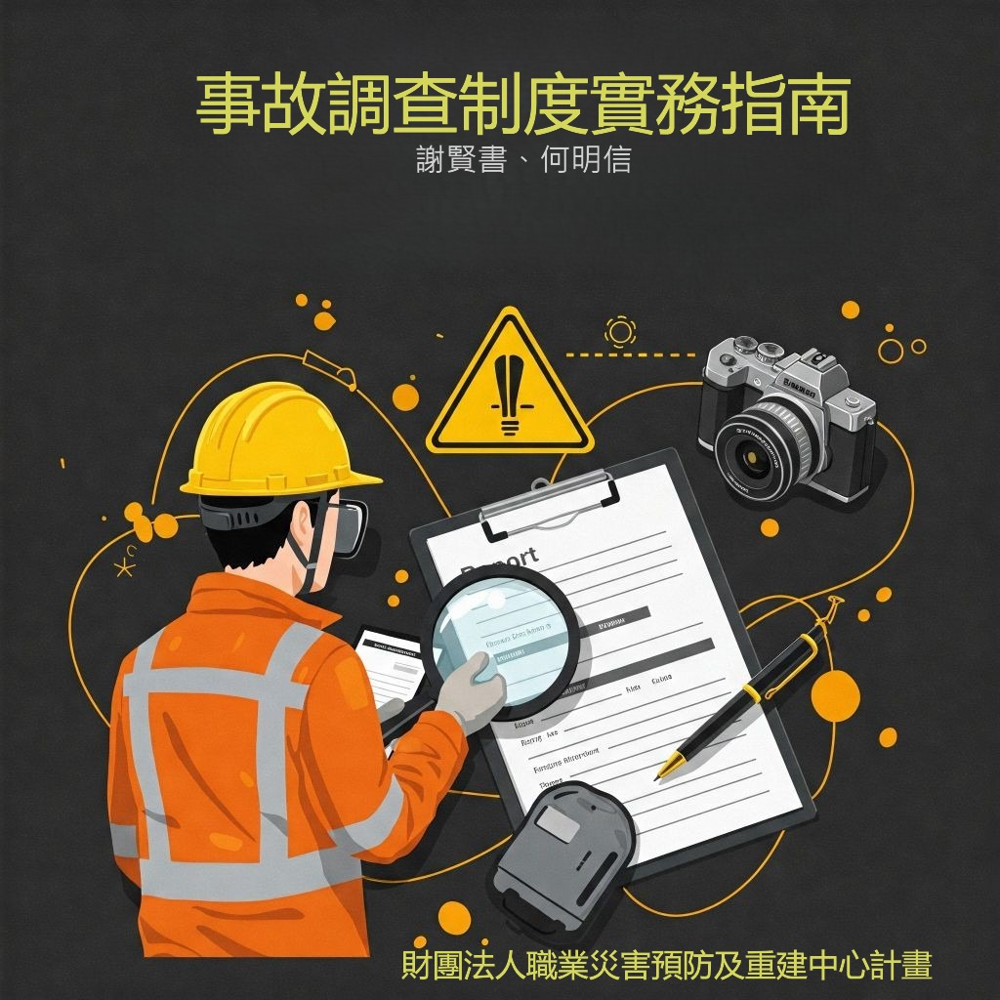

```{r, echo = FALSE, out.width='50%', fig.align='left', fig.cap='...'}

```

> "If you think safety is expensive, try an accident."
>
> --- Chairman of Easy Group


> [本指引主要國內外相關指引，並結合實際案例製作。]
>
請留意，這是一份網路版草稿，內容以經正式審查編印後為準。 This is a markdown book about Occupational Accident investigation.
>

### 摘要 {.unnumbered}
(略)

> 關鍵字：事故調查，事故因果模型，事故成因分析(ECFA)，屏障分析(BA)，根本原因分析(RCA)

### 緣起 {.unnumbered}
(略)

### 參考國內外指引

> 本指引參考國內外相關指引與資料，如下表所列(但不限於此)

: 表一 國內外參考指引 

| No | 機構 | 指引名稱 | 年份 |
|-|:--|:-----|:-----|
|1|	勞研所 IOSH|	事故調查方法應用研究|	2000|
|2|	美國化學工程師學會AIChE|	Guidelines for Investigating Chemical Process Incidents 2nd|	2003|
|3|	英國 HSE|	Investigating accidents and incidents: A workbook for employers, unions, safety representatives and safety professionals(HSG245)	|2004| 
|4|	美國能源部 DOE	|Accident and Operational Safety Analysis, Volume I, Accident Analysis Techniques|	2012|
|5|	美國US OSHA|	Incident [Accident] Investigations: A Guide for Employers|2015|
|6|	聯合國組織ILO| 	A practical guide for labour inspectors: Investigation of occupational accidents and diseases|	2015|
|7|	澳洲 AIHS	|Investigations (Core Body of Knowledge for the Generalist OHS Professional)|	2024|
|||||

## 目錄 {.unnumbered}

### 一. 前言

職業災害事故調查是職業安全衛生管理的基本要素，也是許多全能職業安全衛生專業人員(以下簡稱職安衛人員)的核心職能。事故調查過分強調分析個人的行為，而沒有對導致這些錯誤的潛在系統因素進行充分分析，會導致事故再發。為提高職安衛人員的事故調查能力，本指南說明事故的因果關係模型、調查流程、常用技術與分析工具以及局限性，並概述了矯正措施(改善建議)的制定和調查報告製作，供職安衛人員與工作現場主管從事事故調查的參考，主要目標應該是透過有效調查供企業持續學習，以預防事故再發。

### 二. 事故調查角色定位

### 三. 事故調查定義與術語

### 四. 好的事故調查構成要素

### 五. 事故因果模型

### 六. 事故調查流程與查檢表

### 七. 事故調查專業技術

### 八. 事故調查分析工具

### 九. 結論

### 十. 附錄


### 職災事故個案實例 (演練用)

> 以下案例來自官方公布之職災資訊，應用本指引分析方法，部分內容運用AI產出，僅供演練參考用。

 - [個案實例演練 請新開網頁](cases/cases.html)
 
### 參考資料文獻
(略)
 

 