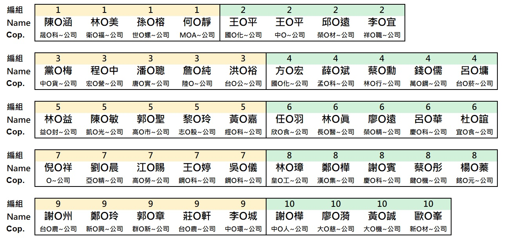

### 本計畫規劃於北中南區辦理4場次宣導會(工作坊)。

## 公告 {.tabset .tabset-fade .tabset-pills}
- 若遇有颱風將至或重大事故等，延期畫變更事宜將於此處公告。
- **報名成功名單 (點選各區查看確認)**

### 辦理單位
- **計畫單位：財團法人職業災害預防及重建中心 **
- **承辦單位：社團法人中華製程安全學會**

### 南區(0805週二)
```{r, echo = FALSE, out.width='100%', fig.align='left', fig.cap='...'}

```

### 中區 0821週四)
(**報名92人**，，將甄選40人)

### 北區1 0902週二)
(**報名87人**，將甄選40人)

### 北區2 0918週四)
(**報名41人**，將甄選40人)

-------

 
## 職災事故個案實例 (演練用)

> 以下案例來自官方公布之職災資訊，應用本指引分析方法，部分內容運用AI產出，僅供演練參考用。

 - [個案實例演練 請新開網頁-(更新中~~)](index.html)
 
## 其它資訊
 - [報名簡章](114年度 我國製造業職災事故調查推廣計畫宣導會 報名簡章.pdf)
 - [事故調查分析方法圖卡：電子檔下載]()

## 事故調查制度實務指南簡介
>依據「114年製造業職業災害事故調查推廣計畫」，製作**「事故調查制度實務指南」**。
>本指南主要參考國內外相關指引，並結合實際案例製作。這裡呈現的是指南一部分摘錄，內容以經正式審查編印後為準。 本指南為提升我國職業災害事故調查品質，提供雇主、職安衛專業人員、勞工代表等，一套系統化且實用的事故調查參考架構與指引，特別強調事故調查分析方法實務使用，以協助職安衛專業人員提升事故調查專業技能，使業者在事故經驗學習時，能有效預防事故發生或再次發生。

### 目錄
. 一. 前言

. 二. 事故調查角色定位

三. 事故調查相關用語與定義

四. 良好事故調查的構成要素
五. 事故因果模型
六. 事故調查流程與查檢表
七. 事故調查的專業技能
八. 事故調查分析方法
九. 矯正改措施建議
十. 事故報告書參考建議
十一. 結論
附錄 (分析方法圖卡等)
- 附錄 A 「事故成因分析/圖 (ECFA/ECFC)」使用參考圖卡
- 附錄 B 「時間序列表」使用參考圖卡
- 附錄 C 「為何樹(WHY Tree)分析」使用參考圖卡
- 附錄 D 「屏障分析(Barrier Analysis)」使用參考圖卡
- 附錄 E 「變更分析(Change Analysis)」使用參考圖卡
- 附錄 F 訪談提示事項 (參考用)
- 附錄 G 良好事故調查要項查檢表(HSE)

### 推薦參考國內外指引

- **表一 參考國內外指引** (本指引參考國內外相關指引與資料，如下表所列但不限於此)

| No | 機構 | 指引名稱 | 年份 |
|-|:--|:-----|:-----|
|1|	勞研所 IOSH|	事故調查方法應用研究|	2000|
|2|	美國化學工程師學會AIChE|	Guidelines for Investigating Chemical Process Incidents 2nd|	2003|
|3|	英國 HSE|	Investigating accidents and incidents: A workbook for employers, unions, safety representatives and safety professionals(HSG245)	|2004| 
|4|	美國能源部 DOE	|Accident and Operational Safety Analysis, Volume I, Accident Analysis Techniques|	2012|
|5|	美國US OSHA|	Incident [Accident] Investigations: A Guide for Employers|2015|
|6|	聯合國組織ILO| 	A practical guide for labour inspectors: Investigation of occupational accidents and diseases|	2015|
|7|	澳洲 AIHS	|Investigations (Core Body of Knowledge for the Generalist OHS Professional)|	2024|
|||||


> 中華製程安全學會 公告 114年07月25日。