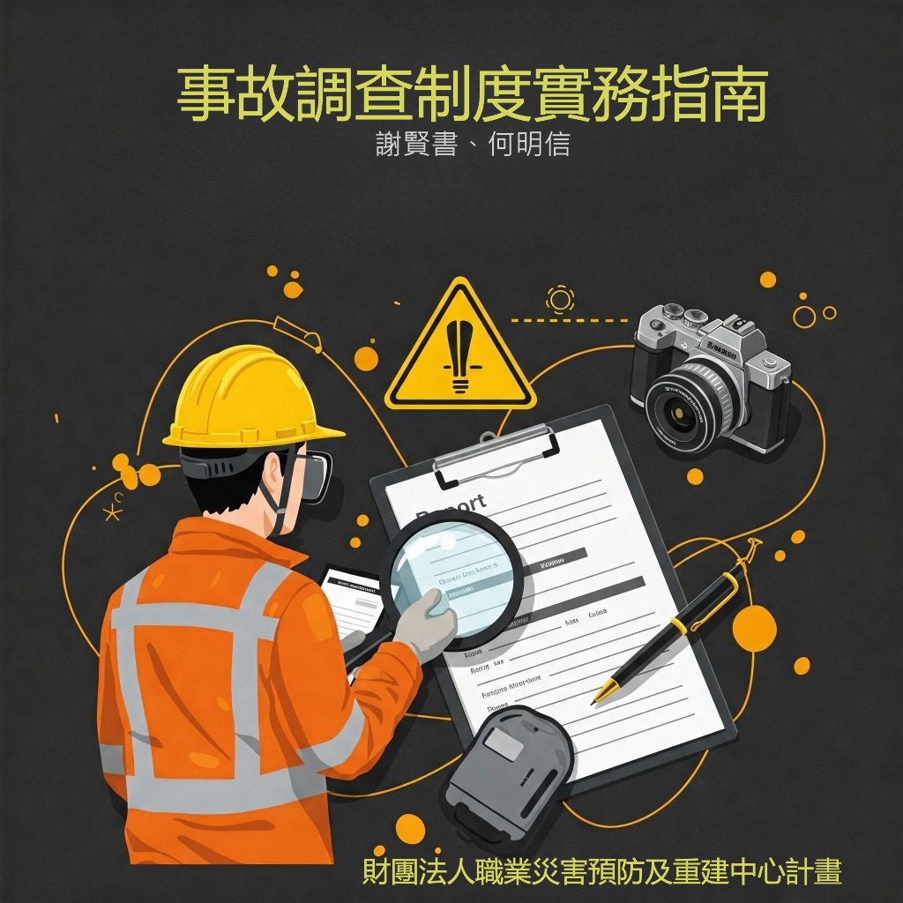

```{r, echo = FALSE, out.width='50%', fig.align='left', fig.cap='...'}

```
> 本指南為提升我國職業災害事故調查品質，提供雇主、職安衛專業人員、勞工代表等，一套系統化且實用的事故調查參考架構與指引，特別強調事故調查分析方法實務使用，以協助職安衛專業人員提升事故調查專業技能，使業者在事故經驗學習時，能有效預防事故發生或再次發生。

>計畫單位：財團法人職業災害預防及重建中心 「114年製造業職業災害事故調查推廣計畫」
>承辦單位：社團法人中華製程安全學會

> [本指引主要國內外相關指引，並結合實際案例製作。]
> 請留意，這裡呈現的是指南一部分摘錄，內容以經正式審查編印後為準。

### 摘要 {.unnumbered}

本「事故調查制度實務指南」旨在為提升我國職業災害事故調查品質，提供事業單位及職業安全衛生專業人員(以下簡稱職安衛專業人員)等，一套系統化且實用的事故調查參考架構與指引，以協助業者在事故經驗學習時，能有效預防事故發生(或再次發生)。本指南強調系統性事故調查的之功能與實務，其不僅是企業展現法律合規與社會責任，更是整合職業安全衛生管理循環(如TOSHMS)的核心樞紐之一，並能催化安全文化的塑造。

事故調查的角色定位已從「事後究責」轉變為「風險治理」的概念，為了使事故調查更具系統與完整性，本指南參考國內外指引，介紹事故因果模型，從簡單線性到複雜非線性模型，理解事故因果模式有助於建立有效的系統性事故預防方法。指南中提供事故調查主要流程與查檢表，供調查人員自我檢核，以完成系統性調查。另也詳細介紹先進國家常用之系統調查分析方法，包括事故成因分析(ECFA)與事故成因圖(ECFC)、時間序列表、為何樹分析(Why Tree)、屏障分析(BA)、變更分析(CA)以及根本原因分析(RCA)。這些分析方法各有其目的與功能，藉由個案示範，事故調查人員可依據事故特性與企業需求，選擇合適的方法，以深入探究事故的立即原因、潛在原因與根本原因。而其中，根本原因分析可以找出管理階層有能力修正的深層原因，避免未來發生類似事件。

本指南亦涵蓋職安衛專業人員在事故調查中應具備的專業技能與注意事項，包含資料收集技術(如證據蒐集與人員訪談技巧)、對策發展思維與調查報告建議等。透過這些專業技能的運用，能確保事故調查的有效性和深度。期望透過本指南的專業且便利之內容，提供業者建立符合自身事故調查制度(含虛驚、職災、與影響身心事件等)之參考，積極防止職災事故發生，確保企業永續經營，與保護工作者安全健康。

本指南原始設計係供企業管理層、有事故調查需求之人員、及職安衛專業人員參考使用，不全然必須從第一章開始閱讀，各章節間可視上述人員專業背景與經驗，或依有興趣之處先行或單獨閱讀，包含調查流程與各分析方法等，亦均可單獨援引或參考。

關鍵字：事故調查，事故因果模型，事故成因分析(ECFA)，屏障分析(BA)，根本原因分析(RCA)

### 參考國內外指引

: 表一 國內外參考指引 (本指引參考國內外相關指引與資料，如下表所列但不限於此)

| No | 機構 | 指引名稱 | 年份 |
|-|:--|:-----|:-----|
|1|	勞研所 IOSH|	事故調查方法應用研究|	2000|
|2|	美國化學工程師學會AIChE|	Guidelines for Investigating Chemical Process Incidents 2nd|	2003|
|3|	英國 HSE|	Investigating accidents and incidents: A workbook for employers, unions, safety representatives and safety professionals(HSG245)	|2004| 
|4|	美國能源部 DOE	|Accident and Operational Safety Analysis, Volume I, Accident Analysis Techniques|	2012|
|5|	美國US OSHA|	Incident [Accident] Investigations: A Guide for Employers|2015|
|6|	聯合國組織ILO| 	A practical guide for labour inspectors: Investigation of occupational accidents and diseases|	2015|
|7|	澳洲 AIHS	|Investigations (Core Body of Knowledge for the Generalist OHS Professional)|	2024|
|||||

## 目錄 {.unnumbered}

### 一. 前言

職業災害事故調查是職業安全衛生管理的基本要素之一，也是許多全能職業安全衛生專業人員(以下簡稱職安衛專業人員)的核心職能。事故調查過分強調不安全行為，而沒有對導致這些錯誤的潛在系統因素進行充分分析，並採行對應之有效對策，極可能會導致事故再發。為協助業者建立系統性事故調查制度，與提高職安衛專業人員的事故調查分析能力，本指南說明了事故的因果關係模型演進、調查流程與查檢表、調查技術與常用調查分析方法，並概述了矯正措施(改善建議)的思維和調查報告製作參考，供職安衛專業人員與工作現場主管等人，從事事故調查的參考，主要目標應該是透過有效調查供企業持續學習，以預防事故再發。

企業在法規、社會道德和財務上都迫切需要尋找有效的職業安全衛生解決方案，來防止與工作相關的事故。然而，職災事故造成的損失龐大，且部分不易明顯看出，根據澳大利亞安全工作局2012-13年度估計，職業災害(以下簡稱職災)事故經濟成本負擔佔全國GDP 4.1%~5% (618億澳幣)，估計其中雇主負擔5%，社會負擔18%，而勞工負擔77% [1]。又美國職業安全衛生署(以下簡稱US OSHA)的報告指出，職災事故對財務和社會影響是巨大的，這些傷害和疾病的勞工及其家人和納稅人支付了大部分經濟成本。舉2012年美國職災事故為例，總和經濟成本為1980億美金，職災勞工難以獲得他們應得的工資損失和醫療費用，加上社會損失成本轉移，職災補償金僅涵蓋職災造成的工資損失和醫療費用的一小部分(也就是雇主只負擔約 21%)，勞工及其家人和他們的私人健康保險支付了近 63% 的費用，剩下的 16% 由納稅人承擔(社會保險機制) [2]。而英國職業安全衛生署(以下簡稱HSE)根據其職災成本模式估計，其2022-2023年度統計顯示，職災總成本為216億英鎊(職業相關疾病造成的總成本約67%比例最大，職業傷害約為33%)，勞工承擔了58%的損失，政府承擔23%、而雇主僅負擔19% [3]。這些官方研究報告都顯示出，罹災勞工及其家庭承擔了大部分的經濟損失，而政府則又替高風險或輕率不負責任的雇主負擔了其應損失的成本。

當然，並非所有與事件相關的成本都是財務成本，職災罹災者及其家人的後果可能包括失去親人、長期病痛和喪失工作能力、謀生能力下降等。這些統計數據強調了避免職災發生，及確保在事故發生後，進行系統性嚴謹和有效調查的必要性，以最大限度地吸取經驗教訓，防止類似事故再度發生。透過事故學習與有效的風險控制策略，將可減少事故發生及其對工作者及其家庭、社區和社會的影響。


### 二. 事故調查角色定位

### 三. 事故調查相關用語與定義

### 四. 良好事故調查的構成要素

### 五. 事故因果模型

### 六. 事故調查流程與查檢表

### 七. 事故調查的專業技能

### 八. 事故調查分析方法

### 九. 矯正改措施建議

### 十. 事故報告書參考建議

### 十一. 結論

### 附錄

附錄 A 「事故成因分析/圖 (ECFA/ECFC)」使用參考圖卡

附錄 B 「時間序列表」使用參考圖卡

附錄 C 「為何樹(WHY Tree)分析」使用參考圖卡

附錄 D 「屏障分析(Barrier Analysis)」使用參考圖卡

附錄 E 「變更分析(Change Analysis)」使用參考圖卡

附錄 F 訪談提示事項 (參考用)

附錄 G 良好事故調查要項查檢表(HSE)

### 參考資料文獻
[1]	SWA, “The cost of work-related injury and illness for Australian employers, workers and the community: 2012-13.” Safe Work Australia, 2015.

[2]	USA OSHA, “Adding inequality to injury the costs of failing to protect workers on the job.” Occupational Safety and Health Administration, Washington, 2015.

[3]	HSE, “Costs to Great Britain of workplace injuries and new cases of work-related Ill Health – 2022/23.” Health and Safety Executive, 2024. [Online]. Available: https://www.hse.gov.uk/statistics/cost.htm

[4]	C.-M. Chang, S.-W. Yu, and R.-C. Chang, “事故調查與分析方法之應用,” 勞工安全衛生研究季刊, vol. 21, no. 1, pp. 86–106, 2013.

[5]	DOE, “Accident and Operational Safety Analysis, Volume I, Accident Analysis Techniques.” U.S. Department of Energy, 2012. Accessed: Mar. 20, 2025. [Online]. Available: https://www.standards.doe.gov/standards-documents/1200/1208-bhdbk-2012-v1

[6]	HSE, “Investigating accidents and incidents.” Health and Safety Executive (HSE), 2004. [Online]. Available: https://www.hse.gov.uk/pubns/books/hsg245.htm

[7]	ILO, “Investigation of Occupational Accidents and Diseases: A Practical Guide for Labour Inspectors.” International Labour Office, 2015. [Online]. Available: https://www.ilo.org/publications/investigation-occupational-accidents-and-diseases

[8]	USA OSHA, “Incident [accident] investigations: A guide for employers.” Washington DC: OSHA, 2015. [Online]. Available: https://www.osha.gov/incident-investigation

[9]	J. K. Wachter and P. L. Yorio, “A system of safety management practices and worker engagement for reducing and preventing accidents: An empirical and theoretical investigation,” Accid. Anal. Prev., vol. 68, pp. 117–130, Jul. 2014, doi: 10.1016/j.aap.2013.07.029.

[10]	ISO, ISO 45001:2018 Occupational health and safety management systems: Requirements with guidance for use, ISO Standard No. 45001:2018, 2018. Accessed: Mar. 25, 2025. [Online]. Available: https://www.iso.org/standard/63787.html

(以下略)
 
### 職災事故個案實例 (演練用)

> 以下案例來自官方公布之職災資訊，應用本指引分析方法，部分內容運用AI產出，僅供演練參考用。

 - [個案實例演練 請新開網頁](cases/cases.html)
 
 
> "If you think safety is expensive, try an accident." --- (Chairman of Easy Group)

> "what-you-look-for-is-what-you-find" --- (Dekker, 2006; Lundberg et al., 2009, 2010).

> “Errors are seen as consequences rather than causes.” ‐-- (James Reason, 2000)

 