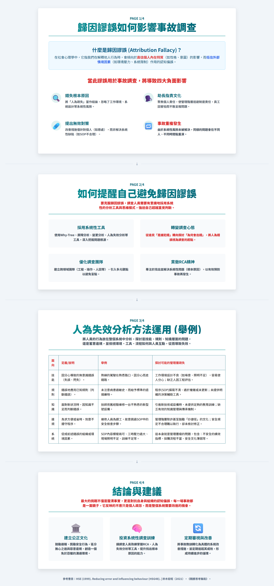

> **認知偏誤？會如何影響事故調查的結果與目的？**
--- 何明信整理

在事故調查中，認知謬誤（cognitive biases）會悄悄影響調查人員的判斷，導致錯誤的結論與改善措施，甚至讓類似事故再次發生。

> 🧠 **什麼是認知謬誤？**

- 1.認知謬誤是指人在思考、判斷或決策過程中，因為心理認知、情緒、經驗或社會影響而產生的系統性偏誤。
- 2.這些偏誤可能讓我們忽略關鍵資訊、過度簡化問題，或過早下結論。

> 🚧 **在職業災害事故調查中，常見認知謬誤：**

- 錯誤歸因：把事故原因歸咎於個人行為，忽略制度或環境因素（如歸因謬誤）。
- 確認偏誤：只尋找支持自己假設的證據，忽略反例。
- 因果偏誤：傾向將事故歸因於單一明顯事件或因素，忽略多重因果鏈與系統性交互作用。
- 選擇性注意：只關注熟悉或容易取得的資訊，忽略其他可能性（如可得性捷思）。
- 事後諸葛偏誤：認為事故「本來就可以預見」，而低估實際複雜性。
- 過度自信：調查人員過度相信自己的判斷，忽略團隊討論或外部意見。
- ......


# {.tabset .tabset-fade .tabset-pills}

### **1.歸因謬誤** - 0811  
- **[歸因謬論? ](歸因謬誤.pdf)**    
- **[歸因謬誤-全圖](歸因謬誤.html)**
```{r, out.width='80%', fig.align='left',echo=FALSE}
# 
```

### **2.確認偏誤** - 0812
- **[確認偏誤? ](確認偏誤.pdf)**
- **[確認偏誤-全圖](確認謬誤.html)**


### **3.因果偏誤** - 0814
- **[因果偏誤? ](因果偏誤.pdf)**
- **[因果偏誤-全圖](因果偏誤.html)**


### **4.後見之明偏誤** - 0815
- **[後見之明偏誤? ](後見之明偏誤.pdf)**
- **[後見之明偏誤-全圖](後見之明偏誤.html)**

### **5.可得性偏誤** - 發展中

