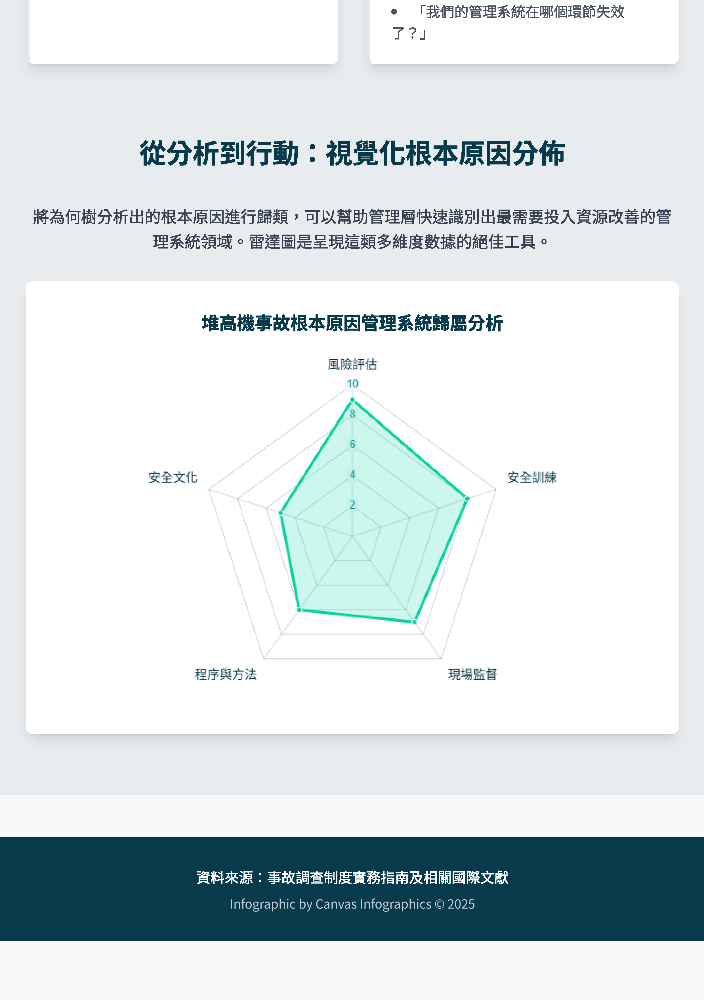
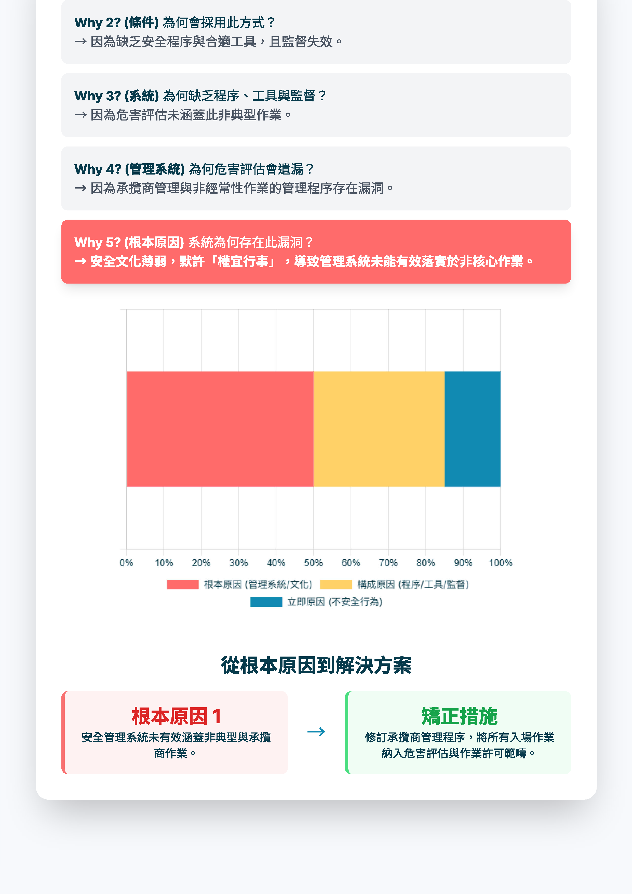

## 分析方法解析 {.tabset .tabset-fade .tabset-pills}

### ECFC 事故成因分析
[ECFC 方法解析-全圖](ECFC.html)
```{r, out.width='50%', fig.align='left',echo=FALSE}


```


### WHY Tree 為何樹分析
[WHY Tree方法解析全圖](Why_Tree.html)
```{r, out.width='50%', fig.align='left',echo=FALSE}


knitr::include_graphics('info_why_3.png')


```


### Barrier Analysis 屏障分析
[Barrier Analysis 方法解析全圖](BA.html)
```{r, out.width='50%', fig.align='left',echo=FALSE}
knitr::include_graphics('info_BA_1.png')

knitr::include_graphics('info_BA_3.png')


```

### Change Analysis 變更分析
[Change Analysis 方法解析全圖](CA.html)
```{r, out.width='50%', fig.align='left',echo=FALSE}


```

### Human Failure Analysis 人為失效分析
[Human Failure Analysis 方法解析全圖](HF.html)
```{r, out.width='50%', fig.align='left',echo=FALSE}


```

### Root Cause Analysis 根本原因分析
[Root Cause Analysis 方法解析全圖](RCA.html)
```{r, out.width='50%', fig.align='left',echo=FALSE}




```

# 參考資料
[事故調查制度實務指南 (草稿)](R5-事故調查制度實務指南-中華製程安全學會編撰.pdf)
(版權所有，請勿做商業用途或營利用)

# 宣導會講義
[事故調查宣導會講義](職災事故調查制度實務指南教材參考 v1.pdf)
(版權所有，請勿做商業用途或營利用)
