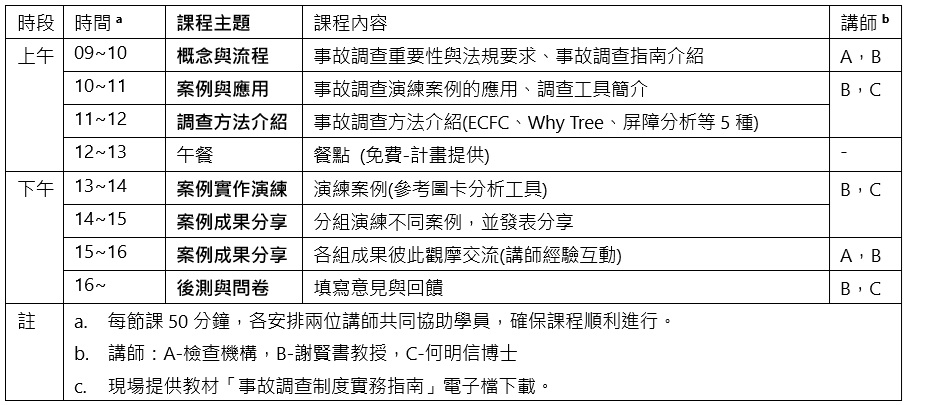

## 114年 事故調查制度實務指南宣導會(工作坊)

---

#### 一、主辦、合辦與執行單位：
- 計畫單位：財團法人職業災害預防及重建中心
- 合辦單位：高雄市政府勞工局勞動檢查處
- 執行單位：社團法人中華製程安全學會

---

#### 二、宣導會(工作坊)時間地點：
- 時間：**114年8月05日(二) 09:00~16:00**
- 地點：**高雄市政府勞工局勞動檢查處 (高雄市鹽埕區中正四路274號4樓 ，新址)**

---

#### **三、成功名單**
```{r, echo = FALSE, out.width='100%', fig.align='left', fig.cap='...'}
knitr::include_graphics('images/南區報名成功名單.jpg')
```

---

#### **四、課程表**
```{r, echo = FALSE, out.width='100%', fig.align='left', fig.cap='...'}

```

---

#### 五、提醒注意事項
- **課程調整權-**	主辦單位保留課程進行與調整權利。
-	**節能減碳-** 為因應減碳政策，本活動盡量不發放紙本教材與教具，電子檔將提供下載連結。
-	**在職教育訓練時數證明-** 全程參與本活動者，合辦單位於活動結束後，依規定核發在職教育訓練時數6小時證明。參加者需於報到時簽到退，遲到或早退15分鐘以上者，不予發放時數條。
-	**突發事件因應-** 如遇不可抗力之特殊狀況（如颱風、地震、疫情等），活動將配合政府公告延期或取消，執行單位事後將以電子郵件通知報名人員改期辦理。
-	**建議學員自備Pen與筆電-** 方便進行案例演練與發表分享，或以A4紙本演練。
- **配合事項-** 活動期間請遵守會場規定，若有飲食灑落造成設備損壞，學員須自負賠償責任。
- **分組演練題目-**


> 中華製程安全學會 公告 114-07-25 